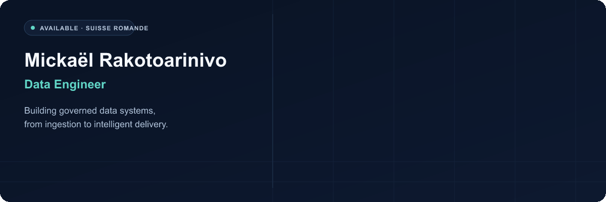
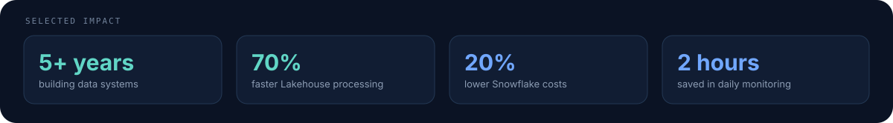
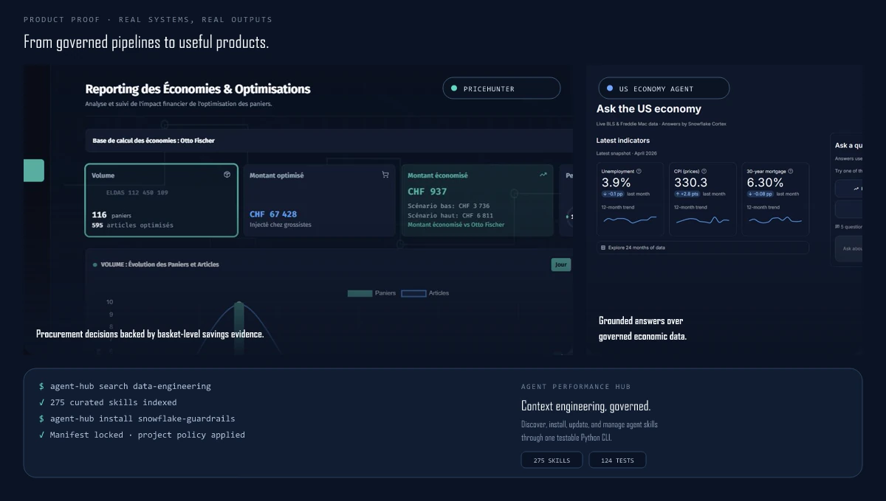
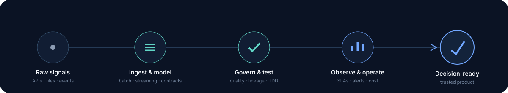

  <picture>
    <source media="(prefers-reduced-motion: reduce)" srcset="assets/readme/hero.svg">
    
  </picture>

  <a href="https://www.linkedin.com/in/mickael-rakotoarinivo/"><strong>Discuss an opportunity ↗</strong></a>
  &nbsp;&nbsp;·&nbsp;&nbsp;
  <a href="#selected-work"><strong>Explore selected work ↓</strong></a>
  &nbsp;&nbsp;·&nbsp;&nbsp;
  <a href="mailto:mickael.rakotoa@gmail.com"><strong>Build with me ↗</strong></a>

  Based in Vaud · Open to opportunities across French-speaking Switzerland

 

<picture>
  <source media="(max-width: 520px)" srcset="assets/readme/impact-mobile.svg">
  
</picture>

## Selected work

### [PriceHunter](https://price-hunter.app/) — B2B procurement optimizer

Turns electrical-supply lists into optimized multi-supplier baskets using live offers, stock, sales units, and contractual prices. From import and comparison to supplier split, transmission, and savings reporting.

The product replaces a fragmented procurement workflow with one traceable decision path. It normalizes imported lists, compares eligible offers without losing supplier constraints, respects real sales units, and produces an actionable basket rather than another spreadsheet. Reporting then closes the loop with processed volume and scenario-based savings evidence.

**July 2026 dev snapshot:** 116 baskets · 595 items optimized · CHF 67.4k processed · CHF 3.7k estimated savings.

`Private source` · **[Live product ↗](https://price-hunter.app/)**

### [US Economy Agent](https://us-economy-agent-caewbffmtchukuynvjsky5.streamlit.app/) — grounded economic intelligence

Transforms live BLS and Freddie Mac data into auto-refreshing Snowflake Dynamic Tables and plain-English answers grounded by Cortex—not model memory. Includes Snowpark ingestion, public-use guardrails, atomic quotas, and a live Streamlit experience.

The architecture keeps the answer connected to its evidence: official source data enters through Snowpark, governed transformations remain refreshable inside Snowflake, and Cortex receives current structured context. The public interface adds fail-closed limits and quota controls so the demo stays useful without turning operational safety into an afterthought.

**[Public source ↗](https://github.com/DOX69/us-economy-agent)** · **[Live demo ↗](https://us-economy-agent-caewbffmtchukuynvjsky5.streamlit.app/)**

### [Agent Performance Hub](https://github.com/DOX69/agent-performance-hub) — context engineering CLI

A Python CLI to discover, install, update, and govern curated AI-agent skills across projects. Ships a 275-skill registry, manifest-based lifecycle management, agent-readable command help, and 124 automated tests.

It treats reusable agent context as engineering infrastructure. Teams can find the right capability, pin what a project depends on, update it deliberately, and expose concise help that another agent can consume. The registry and manifest provide a reviewable control plane instead of relying on copied folders and undocumented local state.

**[Public source ↗](https://github.com/DOX69/agent-performance-hub)** · `Collaboration welcome`

## How I engineer data products

I work across the full path from ingestion to a product people can trust: model the domain, establish data contracts, automate quality controls, observe the pipeline, and ship through CI/CD. The goal is not a beautiful pipeline diagram—it is reliable decisions and measurable operating leverage.

My operating principles are simple:

- **Design for the decision.** Start with the user, business rule, and action the data must support.
- **Make quality executable.** Encode contracts, tests, freshness expectations, and failure behavior in the system.
- **Treat cost as a signal.** Profile workloads, remove avoidable processing, and make tradeoffs visible.
- **Ship operable systems.** Prefer observable, documented pipelines that teams can deploy and recover confidently.

| Platforms | Languages | Engineering |
|:--|:--|:--|
| Databricks · Snowflake · Delta Lake · dbt | Python · PySpark · SQL · Snowpark | Batch & streaming · Data modeling · Data quality · Observability · CI/CD · TDD · Docker |

## Experience

**InPost Group · Data Engineer · 2022–present** 
Lakehouse architecture, PySpark/SQL pipelines, Snowflake-to-Databricks migration, governance, observability, and CI/CD. Built performance and quality improvements that reduced Lakehouse processing time by 70%, Snowflake warehouse costs by 20%, and daily monitoring by two hours.

That work spans production modeling, automated ingestion, dimensional layers, deployment automation, and collaboration with analysts, consultants, and international engineering teams.

**Hoist Finance · Data Analyst · 2021–2022** 
Automated ETL, data-quality controls, and BI workflows, reducing manual processing by 40%.

**MSc in Data Science · University of Lille · 2022** 
Data modeling, ETL, business intelligence, statistics, and machine learning.

## Credentials earned

I previously earned two Databricks associate credentials. Their validity periods have ended; the links below remain the official verification records.

- [Databricks Certified Data Engineer Associate ↗](https://credentials.databricks.com/ddbed759-6674-48bd-8d83-2d840b1ea48f) — earned June 2024 · validity ended June 2026
- [Databricks Certified Data Analyst Associate ↗](https://credentials.databricks.com/1e0fc1de-0299-45ab-bc70-ced535dbfbb4) — earned March 2024 · validity ended March 2026

## Beyond data

Strength training and Aikido keep me disciplined. Financial literacy, investing, and monetary systems keep me curious. I speak French and Malagasy bilingually, and English fluently.

## Let’s build something useful

I am open to data engineering roles across French-speaking Switzerland, and to selected collaborations where strong data foundations can unlock a real product or business outcome.

**[Start a conversation on LinkedIn ↗](https://www.linkedin.com/in/mickael-rakotoarinivo/)** · **[Email me ↗](mailto:mickael.rakotoa@gmail.com)** · [English résumé](pages/CV_Data_Engineer_EN.md) · [CV français](pages/CV_Data_Engineer_FR.md)
